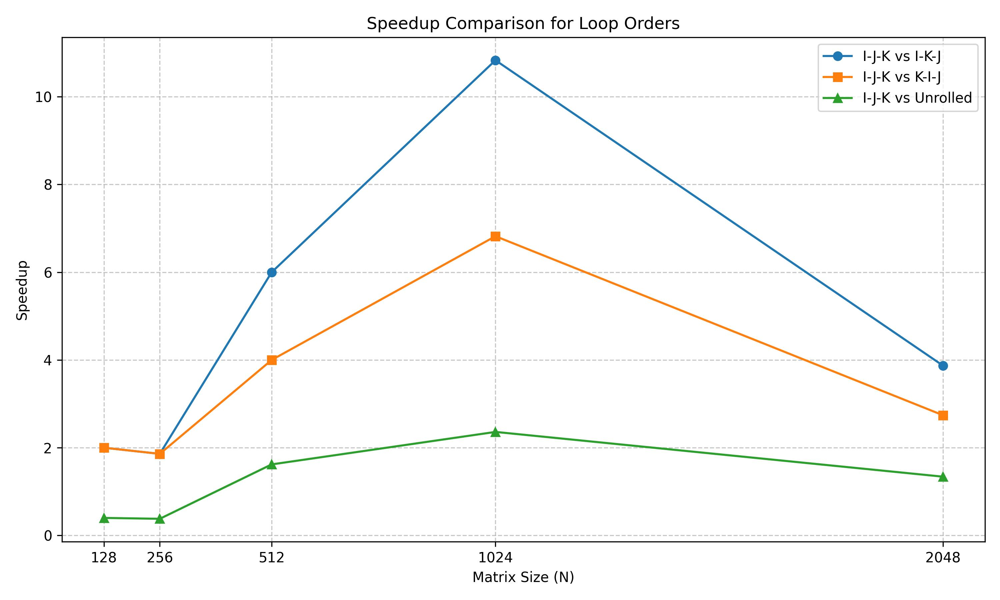
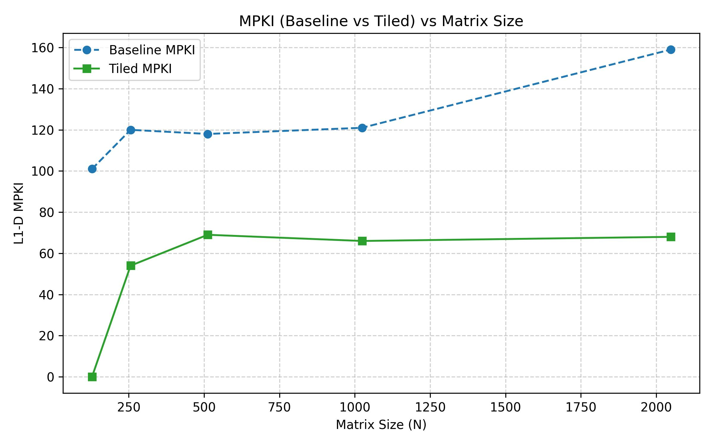
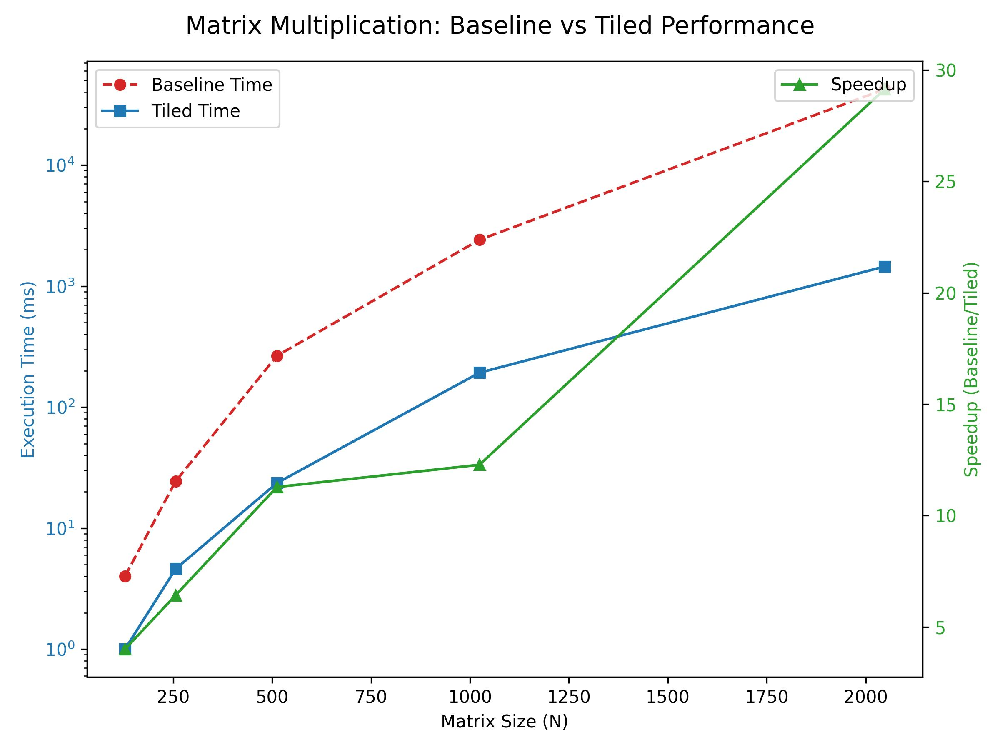
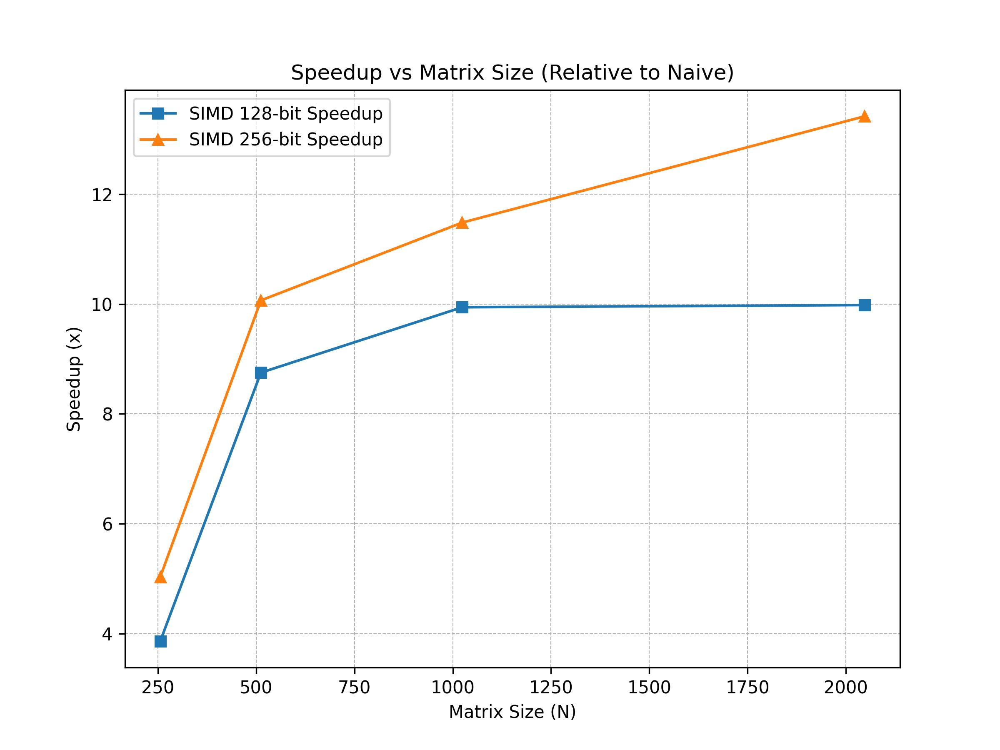
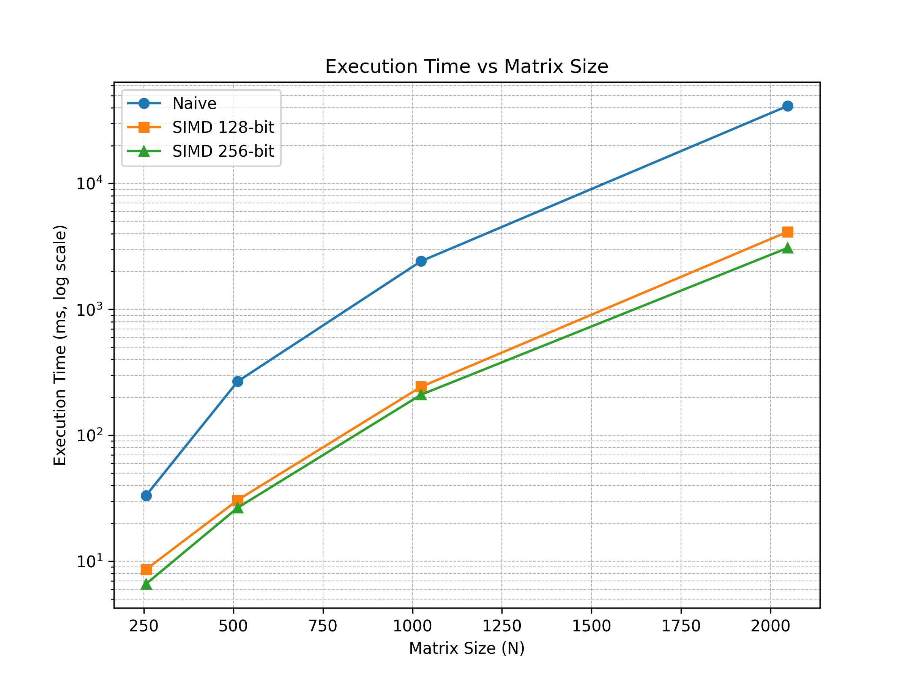
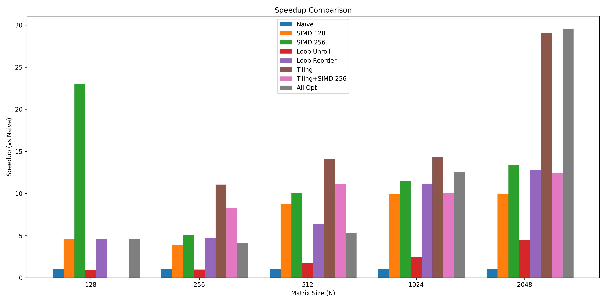
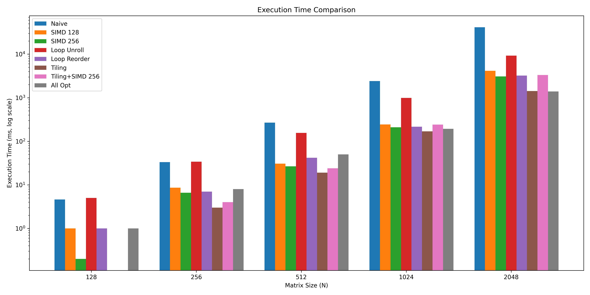
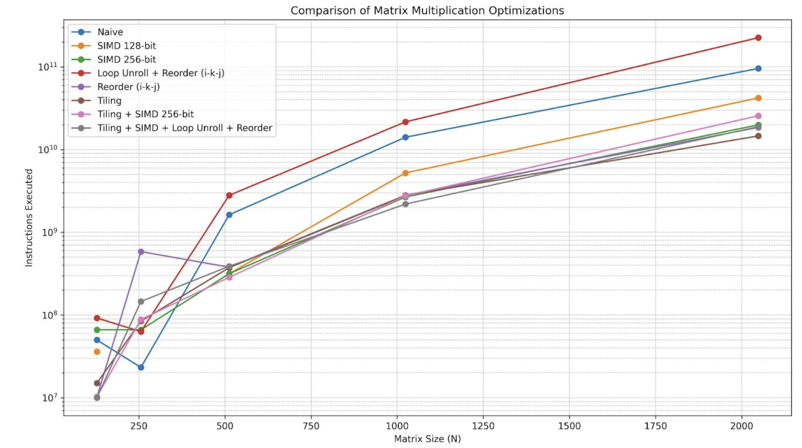

# **TASK 1**  : Matrix Multiplication — The Rancho Way
---

## **INTRODUCTION**

This project implements and evaluates multiple optimizations for matrix multiplication, including:

- Naive multiplication  
- SIMD (128-bit, 256-bit)  
- Loop unrolling  
- Loop reordering (i-k-j)  
- Tiling  
- Tiling + SIMD  
- Tiling + SIMD + loop unrolling + loop reordering  

The performance of each approach was measured in terms of:

- Execution time  
- Speedup compared to naive implementation  
- Instructions executed  
- L1 cache loads  
- L1 cache load misses  
- MPKI (misses per thousand instructions)  

The evaluation was conducted using the **`perf`** tool on Linux.

## **SYSTEM SPECS**

**Architecture:** x86_64  

- CPU op-mode(s): 32-bit, 64-bit  
- Address sizes: 39 bits physical, 48 bits virtual  
- Byte Order: Little Endian  

**CPU(s):** 12  

- On-line CPU(s) list: 0-11  

**Vendor ID:** GenuineIntel  
**Model name:** 12th Gen Intel(R) Core(TM) i5-1235U  

- CPU family: 6  
- Model: 154  
- Thread(s) per core: 2  
- Core(s) per socket: 10  
- Socket(s): 1  
- Stepping: 4  
- CPU(s) scaling MHz: 32%  
- CPU max MHz: 4400.0000  
- CPU min MHz: 400.0000  
- BogoMIPS: 4992.00  

**Operating System:** Ubuntu 22.04 LTS  

**Perf tool version:** perf 6.8.12  

                            
## **Task 1A: Unroll Baba Unroll**

### **Motivation**
- Reordering and unrolling reduce loop overhead and improve data locality.  
- Reordering to `i-k-j` or `k-i-j` with accumulation into `C[i*N + j]` reduces repeated loads/stores to `C` and reduces column-wise access from `B` (compared to `i-j-k` loops).  
- Unrolling reduces branch/loop overhead and increases opportunity for instruction-level parallelism.  

### **Considerations when Implementing**
- Data layout (row-major) and which loop iterates over contiguous memory.  
- Cache behavior: keep inner loop over contiguous memory in `A` or `B`.  
- Prevent register spilling by controlling unroll factor.  
- Effectiveness of changes and metric to quantify effectiveness:  
  - **Execution time (wall-clock):** primary metric for speedup.  
  - **L1-D MPKI (cache misses per 1000 instructions):** shows cache efficiency changes.  
  - **Instruction count:** shows reduction in dynamic instructions.  

## **Table of Comparison**

| Matrix N | Time I-J-K (ms) | Time I-K-J (ms) | Time K-I-J (ms) | Time I-K-J (Loop Unrolled) | Speedup (I-J-K vs I-K-J) | Speedup (I-J-K vs K-I-J) | Speedup (I-J-K vs Unrolled) | MPKI (I-J-K) | MPKI (I-K-J) | MPKI (K-I-J) | MPKI (I-K-J Unrolled) |
| :------- | :-------------- | :-------------- | :-------------- | :------------------------- | :----------------------- | :----------------------- | :-------------------------- | :----------- | :----------- | :----------- | :--------------------- |
| 128      | 2               | 1               | 1               | 5                          | 2.00                     | 2.00                     | 0.40                        | 101          | 29           | 0            | 0.93                   |
| 256      | 13              | 7               | 7               | 34                         | 1.86                     | 1.86                     | 0.38                        | 120          | 50           | 47           | 0.22                   |
| 512      | 252             | 42              | 63              | 156                        | 6.00                     | 4.00                     | 1.62                        | 118          | 41           | 47           | 0.11                   |
| 1024     | 2340            | 216             | 343             | 991                        | 10.83                    | 6.82                     | 2.36                        | 121          | 56           | 43           | 0.10                   |
| 2048     | 12454           | 3221            | 4539            | 9275                       | 3.87                     | 2.74                     | 1.34                        | 159          | 25           | 24           | 0.50                   |

---

### **Plot for Comparison (Speedup)**
  
**Figure 1:** Speedup comparison of different loop orders and optimizations.

---
## **Task 1B: Divide Karo, Rule Karo**

### **Baseline (Naive) Matrix Multiplication Profiling**

| Matrix Size (N) | Instructions Executed | L1-D Misses | MPKI  | Execution Time (s) |
| :-------------- | :------------------- | :---------- | :---- | :----------------- |
| 128             | 26.9 M               | 2.63 M      | 97.6  | 0.0081             |
| 256             | 154.2 M              | 17.0 M      | 110.3 | 0.0095             |
| 512             | 1.13 B               | 132.4 M     | 117.2 | 0.2590             |
| 1024            | 8.82 B               | 1.06 B      | 120.7 | 2.3881             |
| 2048            | 70.7 B               | 9.51 B      | 134.6 | 90.4164            |

---

### **Observations**

1. Across all tested sizes, the baseline multiplication exhibited an **average L1-D MPKI ≈ 116.1**, indicating very high cache pressure.  
2. The **MPKI trend increases with matrix size** (97 → 134), showing frequent L1-D cache misses as the working set exceeds cache capacity.  
3. Execution time grows **super-linearly** (from 128 → 2048), highlighting **poor memory locality** in the naive `i-j-k` implementation.  

  ### **Analysis of Results**

#### 1. **Speedup Achieved (Naive Time / Tiled Time):**
- N = 128 → **4.00x**  
- N = 256 → **6.42x**  
- N = 512 → **11.28x**  
- N = 1024 → **12.28x**  
- N = 2048 → **29.14x**

#### 2. **Why MPKI Improved with Tiling (Cache Behavior & Working Set):**

- **Tiling reduces the working set per inner loop:**  
  Naive matrix multiplication repeatedly scans entire rows/columns, so the live data in the inner loop is large and thrashes L1.  
  Blocking restricts computation to small `A-block × B-block × C-block` sets reused multiple times while still in cache → fewer DRAM/L2 fills, thus fewer L1 misses.  

- **Best tiles map to cache sizes:**  
  - Per-core L1-D ≈ 32 KiB. With `double` (8 bytes), tile size ≤ 32–64 fits nicely in L1.  
  - Larger tiles (128 or 256) also perform well since:  
    1. They leverage **L2/L3** caches (reducing DRAM traffic).  
    2. They reduce **loop overhead**.  
    3. They better align with **hardware prefetchers** and vector loads.  

---

### 🔹 Plots

- **L1-D MPKI vs Matrix Size (for different tile sizes):**  
  

- **Speedup vs Matrix Size (for different tile sizes):**  
  

## **Task 1C: Data Ko Line Mein Lagao**

---

### 1. Baseline Profiling

| Matrix Size (N) | Instructions Executed (Million) |
| :-------------- | :------------------------------ |
| 128             | 23.6                            |
| 256             | 158.4                           |
| 512             | 1187.1                          |
| 1024            | 8818.5                          |
| 2048            | 70776.1                         |

---

### 2. Instruction Count & Performance Analysis

#### (a) Naive Matrix Multiplication Profiling

| Matrix Size | Instructions (Core) | Instructions (Atom) | Total Instructions | Time (ms) | L1-D Loads (Core) | L1-D Loads (Atom) | Total Loads | L1-D Misses (Core) | MPKI (Core) |
| :---------- | :------------------ | :------------------ | :----------------- | :-------- | :---------------- | :---------------- | :---------- | :----------------- | :---------- |
| 128         | 15.8 M              | 35.2 M              | 50.0 M             | 4.6       | 4.25 M            | 8.73 M            | 13.0 M      | 3.98 M             | 113.1       |
| 256         | 65.6 M              | 167.4 M             | 233.0 M            | 33.2      | 19.4 M            | 41.9 M            | 61.3 M      | 19.9 M             | 118.7       |
| 512         | 467.5 M             | 1.16 B              | 1.63 B             | 267.8     | 141.7 M           | 290.9 M           | 432.6 M     | 138.4 M            | 119.4       |
| 1024        | 5.27 B              | 8.83 B              | 14.1 B             | 2414.2    | 1.60 B            | 2.21 B            | 3.82 B      | 1.07 B             | 120.9       |
| 2048        | 25.6 B              | 70.0 B              | 95.5 B             | 41317.8   | 6.57 B            | 17.5 B            | 24.1 B      | 9.45 B             | 120.9       |

---

#### (b) SIMD Profiling (256-bit AVX)

| Matrix Size | Instructions | Time (ms) | L1-D Loads | L1-D Misses | Speedup |
| :---------- | :----------- | :-------- | :--------- | :---------- | :------ |
| 128         | 18.8 M       | 0.2       | 5.46 M     | 0.41 M      | 23.0    |
| 256         | 63.0 M       | 6.6       | 19.5 M     | 2.61 M      | 5.1     |
| 512         | 315.8 M      | 26.6      | 100.2 M    | 12.6 M      | 10.07   |
| 1024        | 2.67 B       | 210.2     | 903.7 M    | 96.3 M      | 11.49   |
| 2048        | 19.9 B       | 3078.6    | 6.34 B     | 310.0 M     | 13.42   |

---

#### (c) SIMD Profiling (128-bit SSE)

| Matrix Size | Instructions | Time (ms) | L1-D Loads | L1-D Misses | Speedup |
| :---------- | :----------- | :-------- | :--------- | :---------- | :------ |
| 128         | 36.1 M       | 1.0       | 11.0 M     | 0.48 M      | 4.4     |
| 256         | 66.3 M       | 8.6       | 21.2 M     | 0.49 M      | 3.7     |
| 512         | 315.8 M      | 30.6      | 166.4 M    | 6.63 M      | 9.2     |
| 1024        | 5.22 B       | 242.8     | 1.72 B     | 96.8 M      | 9.9     |
| 2048        | 42.0 B       | 4138.8    | 13.7 B     | 319.0 M     | 10.2    |

---

### 3. Observations

- Speedup increases with **matrix size**.  
- SIMD provides higher performance gains for large matrices since:  
  - More computations are vectorized.  
  - Memory accesses are optimized.  

---

### 4. Analysis

#### 1. Instruction Count Reduction
- SIMD reduces total executed instructions by a **large factor (~95% for N=2048)**.  
- Works because SIMD processes multiple elements per instruction:  
  - **128-bit SSE** → 2 doubles per vector.  
  - **256-bit AVX** → 4 doubles per vector.  

#### 2. Execution Time Improvement
- SIMD speeds up execution significantly, especially for **large N**.  
- Memory-level parallelism + vectorization reduce loop iterations & memory ops.  

#### 3. Why SIMD Works
- Broadcasts elements of `A`, multiplies with blocks of `B`, and accumulates results in vector registers.  
- Fewer redundant memory accesses.  
- Efficient use of CPU vector units.  

#### 4. SIMD Intrinsics Used
- **SSE (128-bit):**  
  - `_mm_set1_pd()` → broadcast scalar to register  
  - `_mm_loadu_pd()` → load 2 doubles  
  - `_mm_mul_pd()` → element-wise multiply  
  - `_mm_add_pd()` → element-wise add  
  - `_mm_storeu_pd()` → store back to memory  

- **AVX (256-bit):**  
  - `_mm256_set1_pd()` → broadcast scalar to 256-bit register  
  - `_mm256_loadu_pd()` → load 4 doubles  
  - `_mm256_mul_pd()` → element-wise multiply  
  - `_mm256_add_pd()` → element-wise add  
  - `_mm256_storeu_pd()` → store back to memory  

---

### 5. Speedup Plots

- **Speedup: SIMD (128-bit) vs SIMD (256-bit) (Relative to Naive) (Across Matrix Sizes)**  
    
 
- **Execution Time Comparison : SIMD (128-bit) vs SIMD(256-bit) vs Naive (Across Matrix Sizes)**  
  

## **Task 1D: Rancho’s Final Year Project**

---

### **Performance improvement comparison Table of various combination of optimization techniques vs isolation**

---

### 1. **Execution time (ms)**  

| Matrix size(N) | Best tile size | Naive | SIMD 128 bit | SIMD 256 bit | Loop unroll+Loop Reorder(i-k-j) | Loop Reorder(i-k-j) | Tiling (used best tile size) | Tiling + SIMD 256 bit | Tiling + SIMD + loop unroll + loop reorder |
| :---- | :---- | :---- | :---- | :---- | :---- | :---- | :---- | :---- | :---- |
| 128 | 32 | 4.6 | 1.0  | 0.2 | 5 | 1 | 0 | 0 | 1 |
| 256 | 128 | 33.2 | 8.6 | 6.6 | 34 | 7 | 3 | 4 | 8 |
| 512 | 128 | 267.8 | 30.6 | 26.6 | 156 | 42 | 19 | 24 | 50 |
| 1024 | 256 | 2414.2 | 242.8 | 210.2 | 991 | 216 | 169 | 241 | 193 |
| 2048 | 256 | 41,317.8 | 4138.8 | 3078.6 | 9275 | 3221 | 1420 | 3322 | 1397 |

---

### 2. **Instruction Count Comparison (Different Optimizations) (cpu_atom + cpu_core)**

| Matrix size(N) | Best tile size | Naive | SIMD 128 bit | SIMD 256 bit | Loop unroll+Loop Reorder(i-k-j) | Loop Reorder(i-k-j) | Tiling (used best tile size) | Tiling + SIMD 256 bit | Tiling + SIMD + loop unroll + loop reorder |
| :---- | :---- | :---- | :---- | :---- | :---- | :---- | :---- | :---- | :---- |
| 128 | *32/64/128* | 50.0 M | 36.1 M | 66.3 M | 92.2 M  | 10.2 M | 15.0 M | 10.3 M | 10.0 M |
| 256 | *128* | 233 M | 66.3 M | 63.0 M | 584 M | 84.4 M | 88.2 M | 146 M | 85.6 M |
| 512 | 128 | 1.63 B | 316 M | 316 M | 2.80 B | 379 M | 373 M | 285 M | 388 M |
| 1024 | *256* | 14.1 B | 5.22 B | 2.67 B | 21.6 B | 2.81 B | 2.78 B | 2.76 B | 2.19 B |
| 2048 | *256* | 95.5 B | 42.0 B | 19.9 B | 224.8 B | 18.5 B | 14.6 B | 25.6 B | 18.9 B |

---

### 3. **L1-D Cache Loads & Misses (Millions / Billions)**

| N | Best Tile | Optimization | Loads | Misses |
| :---- | :---- | :---- | :---- | :---- |
| 128 | 32/64/128 | Naive | 13.0 M | 0.48 M |
|  |  | SIMD-128 | 11.0 M | 0.48 M |
|  |  | SIMD-256 | 21.2 M | 0.49 M |
|  |  | Loop Unroll + Reorder (i-k-j) | 28.4 M | 0.041 M |
|  |  | Reorder (i-k-j) | 3.0 M | 0.29 M |
|  |  | Tiling | 4.3 M | 0.34 M |
|  |  | Tiling + SIMD-256 | 2.85 M | 0.80 M |
|  |  | Tiling + SIMD + Unroll+Reord | 4.0 M | 0.00 M |
| 256 | 128 | Naive | 13.0 M | 0.48 M |
|  |  | SIMD-128 | 21.2 M | 0.49 M |
|  |  | SIMD-256 | 19.5 M | 2.61 M |
|  |  | Loop Unroll + Reorder (i-k-j) | 182.1 M | 3.21 M |
|  |  | Reorder (i-k-j) | 26.5 M | 4.12 M |
|  |  | Tiling | 28.0 M | 4.42 M |
|  |  | Tiling + SIMD-256 | 43.5 M | 22.7 M |
|  |  | Tiling + SIMD + Unroll+Reord | 30.6 M | 3.70 M |
| 512 | 128 | Naive | 432.6 M | 12.6 M |
|  |  | SIMD-128 | 166.4 M | 6.63 M |
|  |  | SIMD-256 | 100.2 M | 12.6 M |
|  |  | Loop Unroll + Reorder (i-k-j) | 868.4 M | 0.22 M |
|  |  | Reorder (i-k-j) | 120.9 M | 13.9 M |
|  |  | Tiling | 118.8 M | 16.7 M |
|  |  | Tiling + SIMD-256 | 82.0 M | 51.8 M |
|  |  | Tiling + SIMD + Unroll+Reord | 122.9 M | 17.1 M |
| 1024 | 256 | Naive | 3.82 B | 96.3 M |
|  |  | SIMD-128 | 1.72 B | 96.8 M |
|  |  | SIMD-256 | 0.90 B | 96.3 M |
|  |  | Loop Unroll + Reorder (i-k-j) | 6.69 B | 1.65 M |
|  |  | Reorder (i-k-j) | 1.24 B | 103.4 M |
|  |  | Tiling | 0.90 B | 131.3 M |
|  |  | Tiling + SIMD-256 | 0.79 B | 424.4 M |
|  |  | Tiling + SIMD + Unroll+Reord | 0.70 B | 126.9 M |
| 2048 | 256 | Naive | 24.1 B | 310 M |
|  |  | SIMD-128 | 13.7 B | 319 M |
|  |  | SIMD-256 | 6.34 B | 310 M |
|  |  | Loop Unroll + Reorder (i-k-j) | 70.2 B | 7.04 B |
|  |  | Reorder (i-k-j) | 4.82 B | 996 M |
|  |  | Tiling + SIMD-256 | 8.53 B | 3.32 B |
|  |  | Tiling + SIMD + Unroll+Reord | 7.15 B | 992 M |

---

### **D. Observations**

* **Execution time:** Combined optimization significantly reduces time compared to naive or single techniques.  
* **Instruction count:** Combined optimizations reduce unnecessary instructions via SIMD + loop transformations.  
* **Cache behavior:** L1 cache misses are reduced for combined optimization due to better tiling and access patterns.  
* **Synergistic effect:** Speedup of combined > sum of individual optimizations for all matrix sizes.  

---

### **E. Plots**
* **Bar graph for execution time & speed Up comparison:**  
    
    

* **Line graph for comparison of No. of instruction executed:**  
    

