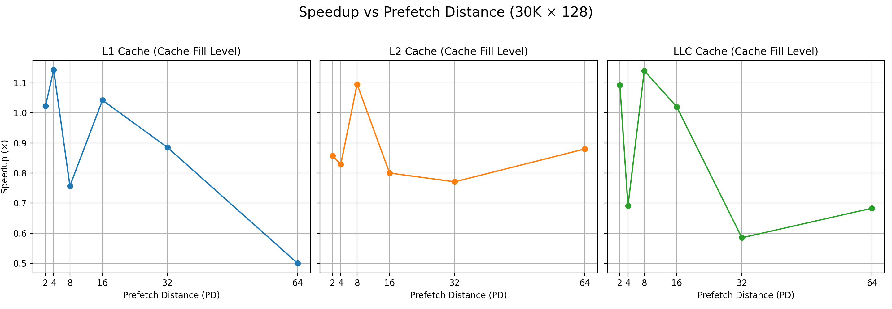
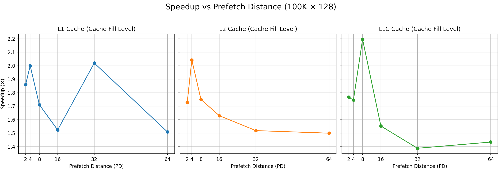
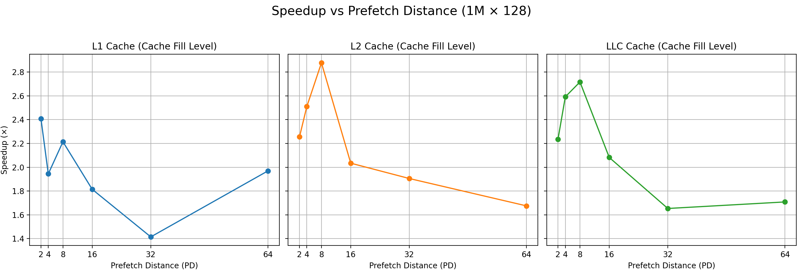
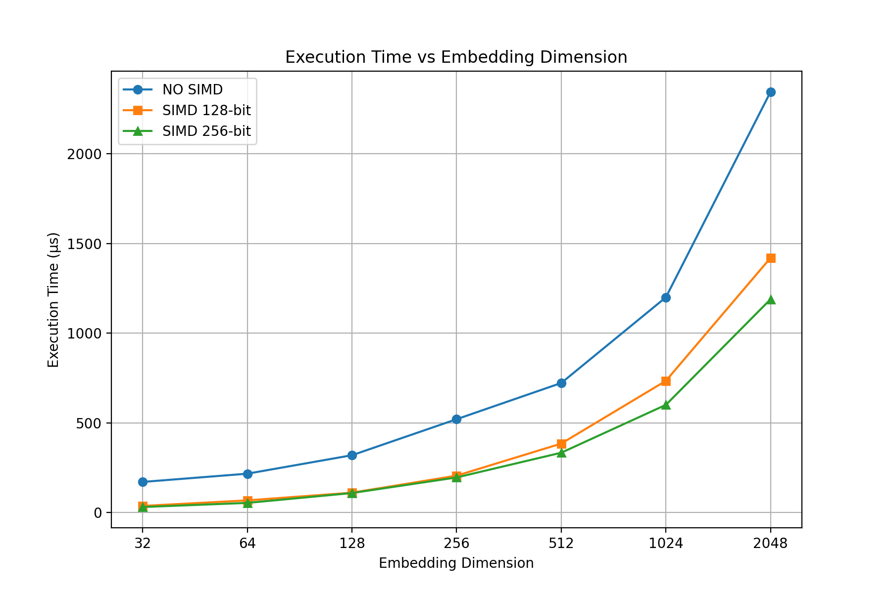
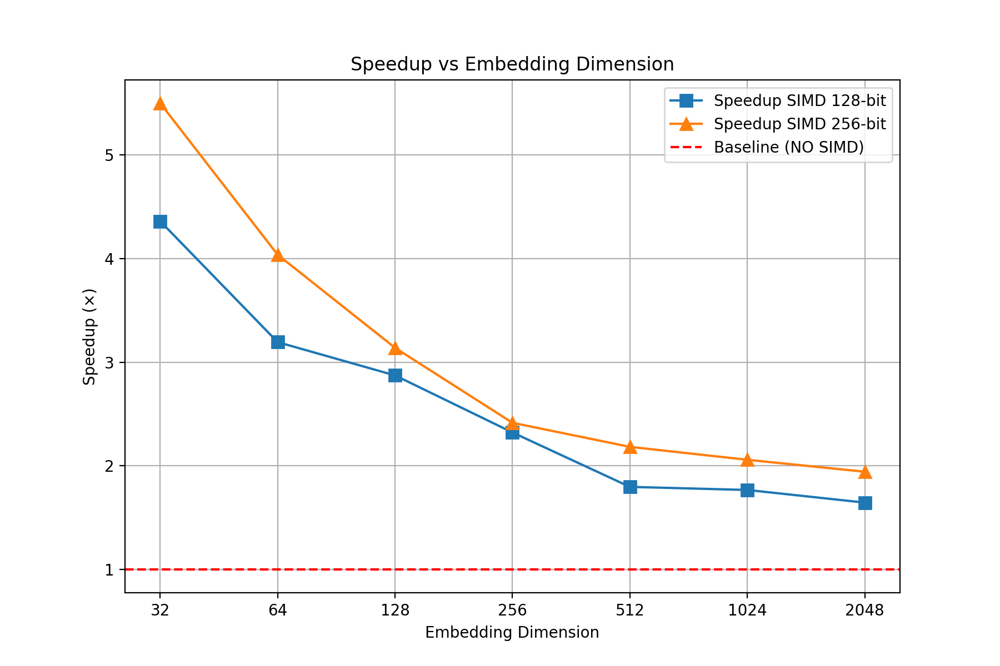
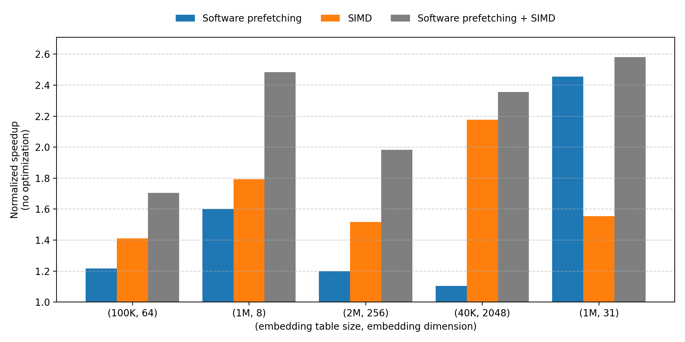

# Task 2 : Embed it - Report
<!-- 
<details open>

<summary>1. Introduction</summary> -->
# 1. Introduction:

## 1. 📊 Example : Embedding Table (4 Dimensions)
Each movie is represented by a vector of 4 scores (dimensions):

- **Dim 1** → Action score  
- **Dim 2** → Comedy score  
- **Dim 3** → Romance score  
- **Dim 4** → Horror score  

| Index | Movie                  | Action | Comedy | Romance | Horror |
|-------|------------------------|--------|--------|---------|--------|
| 0     | Family Man (Web)       | **0.85**   | 0.25   | 0.10    | 0.05   |
| 1     | Avengers (English)     | **0.90**   | 0.35   | 0.10    | 0.00   |
| 2     | Inception (English)    | **0.80**   | 0.05   | 0.10    | 0.05   |
| 3     | Matrix (English)       | **0.90**   | 0.05   | 0.05    | 0.00   |
| 4     | Special Ops (Web)      | **0.92**   | 0.10   | 0.05    | 0.00   |
| 5     | Jab We Met (Hindi)     | 0.10   | **0.40**   | **1.00**    | 0.00   |
| 6     | Student of the Year    | 0.15   | **0.60**   | **0.80**    | 0.00   |
| 7     | DDLJ (Hindi)           | 0.10   | **0.30**   | **1.00**    | 0.00   |
| 8     | 3 Idiots (Hindi)       | 0.10   | **1.00**   | 0.35    | 0.00   |
| 9     | Stree (Horror Comedy)  | 0.20   | **0.65**   | 0.20    | **0.80**   |
| 10    | Bhool Bhulaiyaa        | 0.18   | **0.55**   | 0.15    | **0.85**   |

---

## 2. 🎭 Categorization
- 🔥 **Action**: Family Man, Avengers, Inception, Matrix, Special Ops  
- 💕 **Romance**: Jab We Met, Student of the Year, DDLJ  
- 😂 **Comedy**: 3 Idiots, Stree, Bhool Bhulaiyaa  
- 👻 **Horror**: Stree, Bhool Bhulaiyaa  

---

## 3. 👥 Users & Watched Movies

- 👤 **User Aritra** (Likes Action & Thriller)  
  Watched: Family Man (0), Avengers (1), Inception (2), Matrix (3), Special Ops (4)  

- 👤 **User Sougata** (Likes Romance & RomCom)  
  Watched: Jab We Met (5), Student of the Year (6), DDLJ (7)  

- 👤 **User Hariom** (Likes Comedy & Horror Comedy)  
  Watched: 3 Idiots (8), Stree (9), Bhool Bhulaiyaa (10)  

---

## 4. 📝 Input Representation
- **Input vector**: `[0, 1, 2, 3, 4, 5, 6, 7, 8, 9, 10]`  
- **Offsets** (start index of each user's bag): `[0, 5, 8]`  

**Meaning:**  
- User **Aritra** → indices 0 to 4  
- User **Sougata** → indices 5 to 7  
- User **Hariom** → indices 8 to 10  

---

## 5. 🧮 Bagging Calculation


### 👤 User Aritra (Action Lover)

| Movie             | Action | Comedy | Romance | Horror |
|-------------------|--------|--------|---------|--------|
| Family Man        | 0.85   | 0.25   | 0.10    | 0.05   |
| Avengers          | 0.90   | 0.35   | 0.10    | 0.00   |
| Inception         | 0.80   | 0.05   | 0.10    | 0.05   |
| Matrix            | 0.90   | 0.05   | 0.05    | 0.00   |
| Special Ops       | 0.92   | 0.10   | 0.05    | 0.00   |
| **Sum**           | **4.37** | **0.80** | **0.40**  | **0.10** |
---
**Final Vector**  : (**4.37**, 0.80, 0.40, 0.10) 


### 👤 User Sougata (Romance Lover)

| Movie                | Action | Comedy | Romance | Horror |
|----------------------|--------|--------|---------|--------|
| Jab We Met           | 0.10   | 0.40   | 1.00    | 0.00   |
| Student of the Year  | 0.15   | 0.60   | 0.80    | 0.00   |
| DDLJ                 | 0.10   | 0.30   | 1.00    | 0.00   |
| **Sum**              | **0.35** | **1.30** | **2.80**  | **0.00** |
---
**Final Vector**  :   (0.35, 1.30, **2.80**, 0.00)


### 👤 User Hariom (Comedy + Horror Lover)

| Movie           | Action | Comedy | Romance | Horror |
|-----------------|--------|--------|---------|--------|
| 3 Idiots        | 0.10   | 1.00   | 0.35    | 0.00   |
| Stree           | 0.20   | 0.65   | 0.20    | 0.80   |
| Bhool Bhulaiyaa | 0.18   | 0.55   | 0.15    | 0.85   |
| **Sum**         | **0.48** | **2.20** | **0.70**  | **1.65** |
---

**Final Vector** : (0.48, **2.20**, 0.70, **1.65**) 


---

## 6. 📦 Output Table

| User    | Final Embedding Vector     |
|---------|----------------------------|
| Aritra  | (**4.37**, 0.80, 0.40, 0.10)   |
| Sougata | (0.35, 1.30, **2.80**, 0.00)   |
| Hariom  | (0.48, **2.20**, 0.70, **1.65**)   |

---

## 7. 💻 Pseudocode
```bash
START Embedding Bagging:

FOR 'EACH user': 
    Create a bag with 4 empty slots [0, 0, 0, 0]

FOR EACH movie the user watched: 
    Get the movie's scores from the embedding table 
    Add each score to the corresponding slot in the bag

Save the final bag as the user's profile

END

```

**In simple terms**:  
1. Take an empty bag for each user  
2. For every movie they watched, grab its genre scores  
3. Keep adding those scores to the bag  
4. The final bag shows what the user likes most  

---

## 8. 🎯 Interpretation & Recommendations

- 🔥 **User Aritra** (Action Score: 4.37)  
  *Action enthusiast*  
  **Recommend**: Mission Impossible, Extraction, War, Fast & Furious  

- 💕 **User Sougata** (Romance Score: 2.80)  
  *Romance and emotional storytelling lover*  
  **Recommend**: Kal Ho Naa Ho, Yeh Jawaani Hai Deewani  

- 😂👻 **User Hariom** (Comedy: 2.20, Horror: 1.65)  
  *Enjoys horror-comedy blend*  
  **Recommend**: Go Goa Gone, Roohi, Housefull series  

---

## 9. 🚀 Why This Matters
This embedding bagging operation is the **core of recommendation systems**:

- Netflix → understands your viewing patterns  
- Amazon → personalizes product suggestions  
- Spotify → tailors your music discovery  

By **aggregating interactions**, AI systems learn your preferences and suggest similar content!

<!-- </details> -->

<!-- ------------------------------------------------------------------------------------------------ -->

<!-- <details open>

<summary>2. Instructions to Run Experiments</summary> -->

# 2. Instructions to Run Experiments
## 1. Overview

This assignment implements an **Embedding Operation with Software Prefetch Optimization & SIMD**.  
The goal is to **optimize memory access** and **reduce latency** by leveraging:

- Software prefetch instructions  
- SIMD vectorization (SSE,AVX)  
- Controlled CPU frequency and single-core execution  

The provided script `run_analysis.sh` automates compilation, HW prefetch control, and performance measurement using `perf`.

---

## 2. Usage of `run_analysis.sh`

**Script format:**  
```
./run_analysis.sh [mode] [hw_prefetch]
```

**Arguments:**  

| Argument       | Options                    | Description |
|----------------|---------------------------|-------------|
| mode           | naive, prefetch, simd, both | Select the implementation variant to run |
| hw_prefetch    | enable, disable (optional, default: enable) | Control hardware prefetcher |

**Example:**  
```
./run_analysis.sh simd disable
```
This runs the SIMD-optimized embedding with **hardware prefetch disabled**.

---

## 3. Compilation Options

### 3.1 SIMD / Both Modes
- Compiler optimizations **disabled** for accurate performance measurement:  

```
g++ -O0 -mavx2 -mfma -fno-tree-vectorize -fno-unroll-loops -fno-inline -std=c++17 -o emb emb.cpp
```

### 3.2 Software Prefetch Only
- Compiler optimizations **enabled**:  

```
g++ -O3 -mavx2 -mfma -march=native -std=c++17 -o emb emb.cpp
```

> ⚠ Runs **only on core 1** with CPU frequency fixed to **performance mode** to prevent variations. Each case performs **cache flushes** before execution to simulate cold misses.

---

## 4. Modifying Experiment Parameters

All changes to embedding dimension, table size, cache level, software prefetch distances, or SIMD width are done **inside `emb.cpp`**.

After modification:  

```
./run_analysis.sh [mode] [hw_prefetch]
```

---

## 5. Performance Measurement

- The script runs `perf stat` capturing:  
  - instructions, cycles, cache-misses  
  - L1/L2/LLC cache misses  
  - software prefetch hits/misses  
  - T0, T1/T2, NTA prefetch accesses  

- Logs are saved as:  
```
perf_[mode]_pf[enabled/disabled].log
```

- Output also printed to the terminal.

---

## 6. HW Prefetcher Control

**Requirements:**  
```
sudo apt-get install msr-tools
sudo modprobe msr
```

**Commands:**  

| Action                         | Command |
|--------------------------------|---------|
| Read status (core 1)           | sudo rdmsr -p 1 0x1A4 |
| Disable prefetch (core 1)      | sudo wrmsr -p 1 0x1A4 0xF |
| Enable prefetch (core 1)       | sudo wrmsr -p 1 0x1A4 0x3 |

**Prefetcher Bits in MSR 0x1A4:**  

| Bit | Prefetcher                     | 0=Disabled / 1=Enabled |
|-----|--------------------------------|-----------------------|
| 0   | L2 Hardware Prefetcher (Streamer) | 0 / 1 |
| 1   | L2 Adjacent Cache Line Prefetcher | 0 / 1 |
| 2   | L1 DCU Hardware Prefetcher       | 0 / 1 |
| 3   | L1 DCU IP Prefetcher             | 0 / 1 |

> Initial value = 0x3 (binary 0011):  
> - L2 Hardware Prefetcher → Disabled  
> - L2 Adjacent Cache Line Prefetcher → Disabled  
> - L1 DCU Hardware Prefetcher → Enabled  
> - L1 DCU IP Prefetcher → Enabled  

---

## 7. Expected Deliverables

- Optimized `emb` executable  
- Plots in `Plots/` folder showing performance & cache behavior  
- `cache_effect.pdf` documenting analysis, including:  
  - Software prefetch & SIMD impact  

<!-- </details> -->

<!-- ------------------------------------------------------------------------------------------------ -->

<!-- <details open>

<summary>3. System Architecture & Setup</summary> -->
# System Architecture & Setup
<!-- # 🖥️ System Architecture & Hardware Setup -->

## 1. Machine Details

- **CPU Model:** Intel 12th Gen Core i5-12400  
- **Architecture:** x86_64 (64-bit)  
- **Physical Cores:** 6  
- **Threads:** 12 (2 per core)  
- **Max Frequency:** 4.4 GHz  

---

## 2. Cache Hierarchy & Size

| Cache Level       | Size (per core / shared) | Notes / Approximate Capacity (for 128-dim embeddings)                    |
|------------------|-------------------------|-------------------------------------------------------------------------|
| L1 Data           | 48 KB (per core)       | Private, holds ~768 cache lines (64B each); can store ~93 embeddings (512 B each) |
| L1 Instruction    | 32 KB (per core)       | Private instruction cache per core                                      |
| L2                | 1.25 MB (per core)     | Private, holds ~20,480 cache lines; can store ~2,560 embeddings        |
| L3                | 18 MB (shared)         | Shared across cores, holds ~288,000 cache lines; can store ~36,000 embeddings |


> **Cache Line Size (CL):** 64 Bytes → 16 floats (4B) per line  

**Approximate Latencies:**  
- L1 Data: 2 cycles  
- L2: 12 cycles  
- L3: 30 cycles  
- DRAM: 200 cycles

**Embedding Row Example:**  
- Embedding dimension = 128 floats → 512 Bytes → 8 cache lines per row  

**MSHRs :** ~10–32 per core  


---

## 3. Instruction Sets & Extensions

- **SIMD / Vectorization:** SSE, SSE2, SSE3, SSSE3, SSE4.1, SSE4.2, AVX2  
- **Other Extensions:** BMI1, BMI2, AES, SHA-NI, FMA  
- **No AVX-512 support detected**  

> Supports SIMD vectorization of **128-bit SSE** and **256-bit AVX** for float.


---
<!-- </details>


<details open>

<summary>4. Task 2A – Software prefetching</summary> -->
# 4. Task 2A – Software prefetching
## 4.1 Experimental Setup

**Dataset & Parameters:**
- Embedding Dimensions: 128  
- Dataset Sizes: 30K × 128, 100K × 128, 1M × 128  
- Page Dispatch (PD) variations: 2, 4, 8, 16, 32, 64  
- Cache Fill Levels (CFL): L1, L2, LLC  
- Software Prefetch Requests: Enabled / Disabled  
- Execution Timing: measured in µs  

**System & Execution Settings:**
- CPU: Core 1 only, frequency fixed to **performance mode**  
- Hardware Prefetch: Disabled for controlled runs  
- Compiler Flags:
  `g++ -O3 -mavx2 -mfma -march=native -std=c++17`  
- Cache flushed before each run to simulate **cold misses**  

**How to Run:**
```bash
./run_analysis.sh prefetch [hw_prefetch]
```
- `[hw_prefetch]`: enable (default) / disable  

**Modifications:**
- Change embedding dimensions, table size, software prefetch distances, cache level inside `emb.cpp`  
- Re-run the script after changes  

---

## 4.2 Results Table
### Dataset: 30K × 128


| Metric                 | PD2 L1 | PD2 L2 | PD2 LLC | PD4 L1 | PD4 L2 | PD4 LLC | PD8 L1 | PD8 L2 | PD8 LLC | PD16 L1 | PD16 L2 | PD16 LLC | PD32 L1 | PD32 L2 | PD32 LLC | PD64 L1 | PD64 L2 | PD64 LLC |
|------------------------|--------|--------|--------|--------|--------|--------|--------|--------|--------|--------|--------|--------|--------|--------|--------|--------|--------|--------|
| **L1D Miss**           | 87K    | 88K    | 88K    | 89K    | 88K    | 88K    | 91K    | 93K    | 89K    | 90K    | 87K    | 89K    | 87K    | 89K    | 75K    | 90K    | 90K    | 81K    |
| **L2 Miss**            | 161K   | 131K   | 129K   | 132K   | 130K   | 132K   | 132K   | 145K   | 135K   | 133K   | 132K   | 135K   | 150K   | 140K   | 128K   | 168K   | 139K   | 166K   |
| **LLC Miss**           | 18K    | 19K    | 19K    | 20K    | 16K    | 16K    | 20K    | 21K    | 18K    | 19K    | 16K    | 17K    | 20K    | 21K    | 20K    | 20K    | 23K    | 22K    |
| **SW Prefetch Req.**   | 134    | 133    | 133    | 132    | 135    | 133    | 133    | 130    | 134    | 132    | 145    | 135    | 137    | 130    | 139    | 135    | 135    | 140    |
| **Execution Time (µs)**| 44     | 56     | 43     | 42     | 41     | 55     | 74     | 42     | 43     | 48     | 45     | 49     | 52     | 48     | 65     | 66     | 50     | 63     |
| **Speedup**            | 1.023x | 0.857x | 1.093x | 1.143x | 0.829x | 0.691x | 0.757x | 1.095x | **1.140x** | 1.042x | 0.800x | 1.020x | 0.885x | 0.771x | 0.585x | 0.500x | 0.880x | 0.683x |

--- 
### Dataset: 100K × 128


| Metric                 | PD2 L1 | PD2 L2 | PD2 LLC | PD4 L1 | PD4 L2 | PD4 LLC | PD8 L1 | PD8 L2 | PD8 LLC | PD16 L1 | PD16 L2 | PD16 LLC | PD32 L1 | PD32 L2 | PD32 LLC | PD64 L1 | PD64 L2 | PD64 LLC |
|------------------------|--------|--------|--------|--------|--------|--------|--------|--------|--------|--------|--------|--------|--------|--------|--------|--------|--------|--------|
| **L1D Miss**           | 121K   | 147K   | 130K   | 150K   | 148K   | 151K   | 112K   | 110K   | 134K   | 147K   | 134K   | 149K   | 151K   | 143K   | 151K   | 135K   | 109K   | 104K   |
| **L2 Miss**            | 256K   | 261K   | 256K   | 305K   | 263K   | 269K   | 258K   | 261K   | 258K   | 259K   | 259K   | 287K   | 269K   | 265K   | 267K   | 253K   | 256K   | 253K   |
| **LLC Miss**           | 20K    | 20K    | 17K    | 20K    | 19K    | 17K    | 22K    | 19K    | 20K    | 22K    | 17K    | 19K    | 20K    | 18K    | 19K    | 22K    | 17K    | 18K    |
| **SW Prefetch Req.**   | 2.214K | 2.263K | 2.257K | 391    | 2.140K | 2.142K | 1.899K | 1.939K | 1.926K | 1.474K | 1.490K | 1.482K | 614    | 607    | 618    | 376    | 380    | 390    |
| **Execution Time (µs)**| 43     | 44     | 43     | 44     | 47     | 47     | 45     | 44     | 46     | 63     | 46     | 47     | 51     | 52     | 67     | 53     | 52     | 53     |
| **Speedup**            | 1.860x | 1.727x | 1.767x | 2.000x | 2.043x | 1.745x | 1.711x | 1.750x | **2.196x** | 1.524x | 1.630x | 1.553x | 2.020x | 1.519x | 1.388x | 1.509x | 1.500x | 1.434x |

---

### Dataset: 1M × 128

| Metric                 | PD2 L1 | PD2 L2 | PD2 LLC | PD4 L1 | PD4 L2 | PD4 LLC | PD8 L1 | PD8 L2 | PD8 LLC | PD16 L1 | PD16 L2 | PD16 LLC | PD32 L1 | PD32 L2 | PD32 LLC | PD64 L1 | PD64 L2 | PD64 LLC |
|------------------------|--------|--------|--------|--------|--------|--------|--------|--------|--------|--------|--------|--------|--------|--------|--------|--------|--------|--------|
| **L1D Miss**           | 806K   | 758K   | 807K   | 806K   | 767K   | 810K   | 783K   | 783K   | 766K   | 827K   | 791K   | 786K   | 814K   | 792K   | 778K   | 869K   | 808K   | 774K   |
| **L2 Miss**            | 1,970K | 1,977K | 1,966K | 2,018K | 1,976K | 2,038K | 2,013K | 1,965K | 1,996K | 2,016K | 1,985K | 2,009K | 2,058K | 2,018K | 2,083K | 2,080K | 2,009K | 2,005K |
| **LLC Miss**           | 99K    | 103K   | 101K   | 156K   | 107K   | 123K   | 119K   | 103K   | 114K   | 114K   | 107K   | 113K   | 138K   | 109K   | 119K   | 163K   | 143K   | 113K   |
| **SW Prefetch Req.**   | 5.684K | 3.786K | 3.788K | 3.795K | 3.794K | 3.781K | 3.795K | 5.309K | 3.789K | 3.798K | 3.787K | 3.790K | 3.796K | 3.787K | 3.801K | 3.797K | 3.774K | 3.791K |
| **Execution Time (µs)**| 54     | 55     | 55     | 71     | 49     | 49     | 56     | 49     | 46     | 70     | 59     | 61     | 87     | 63     | 75     | 64     | 77     | 72     |
| **Speedup**            | 2.407x | 2.255x | 2.236x | 1.944x | 2.510x | 2.592x | 2.214x | **2.878x** | 2.717x | 1.814x | 2.034x | 2.082x | 1.414x | 1.905x | 1.653x | 1.969x | 1.675x | 1.708x |
---

## 4.3 Plots
- **Speedup vs Prefetch Distance (for different Cache Fill Levels)**  
- 30K × 128  
  

- 100K × 128  
  

- 1M × 128  
  

---

## 4.4 Notes & Observations

- **Cache Hierarchy & Latency Context:**  
  - Embedding row (128-dim = 512B) spans **8 cache lines (64B each)**.  
  - **L1 (48 KB, 2 cycles):** Can only hold ~93 embeddings → quickly evicted.  
  - **L2 (1.25 MB, 12 cycles):** Holds ~2,560 embeddings → more effective for reuse.  
  - **LLC (18 MB, 30 cycles):** Holds ~36,000 embeddings → best trade-off between capacity and latency.  
  - DRAM access (~200 cycles) dominates if prefetch fails → hiding this latency is the main benefit of software prefetch.

- **Prefetch Distance (PD) Behavior:**  
  - **Too small (PD = 2–4):** Prefetch arrives too late → misses still visible at load time. Memory latency not fully hidden.  
  - **Too large (PD ≥ 32–64):** Prefetch arrives too early → cache lines get evicted before use, causing **cache pollution** and wasted bandwidth.  
  - **Sweet spot: PD = 8.** Aligns well with cache line traversal (8 CLs per row) and hardware MSHR limits (~10–32 per core). Provides maximum overlap of demand with prefetch without eviction.

- **Cache Fill Level (CFL) Impact:**  
  - **L1 target:** Prefetched lines often evicted before use (too small to hold embeddings).  
  - **L2 target:** Moderate improvement but still limited capacity (~2.5K embeddings).  
  - **LLC target:** Consistently best results across datasets. Large capacity ensures prefetched lines remain resident until used → balances latency (~30 cycles) and cache residency.  

- **Performance Observations:**  
  - **30K × 128:** Speedup peaked at **~1.14× (PD8, LLC)**.  
  - **100K × 128:** Best case **~2.19× (PD8, LLC)**.  
  - **1M × 128:** Maximum **~2.88× (PD8, L2/LLC)**, showing scalability when embedding rows exceed lower cache capacities.  
  - Execution time reduction is directly tied to **prefetch hiding DRAM latency** while avoiding premature eviction.  

- **Overall Takeaway:**  
  - **PD = 8 with LLC fill** consistently emerges as the **optimal configuration**.  
  - Smaller PD fails to hide latency; larger PD pollutes caches.  
  - Prefetching into L2/LLC outperforms L1 due to higher capacity and better residency for 128-dim embeddings.  


<!-- </details>


<details open>

<summary>5. Task 2B – SIMD</summary> -->
# 5. Task 2B – SIMD

### 5.1 Experimental Setup
- SIMD widths tested: 128-bit (SSE), 256-bit (AVX)  
- Execution behavior: No flush
- CPU frequency pinned in **performance mode**  
- Embedding size: 1,000,000  
- Compiler optimization disabled for SIMD runs:  
  `g++ -O0 -mavx2 -mfma -fno-tree-vectorize -fno-unroll-loops -fno-inline -std=c++17 -o emb emb.cpp`  
- Run on **core 1 only**  
- HW prefetcher disabled during these runs  
**How to Run:**
```bash
./run_analysis.sh simd [hw_prefetch]
```
- `[hw_prefetch]`: enable (default) / disable  

### 5.2 Results Table
## Embedding Size = 1,000,000
|                    | Embedding Dimension → | 32     | 64     | 128    | 256    | 512    | 1024   | 2048   |
|--------------------|------------------------|--------|--------|--------|--------|--------|--------|--------|
| **NO SIMD**        | Instructions           | 10.6B  | 21.2B  | 42.3B  | 84.7B  | 169.6B | 339.1B | 678.2B |
|                    | Execution Time (µs)         | 170    | 216    | 319    | 520    | 722    | 1200   | 2346   |
| **SIMD 128 bits**  | Instructions           | 10.6B  | 21.1B  | 42.1B  | 84.1B  | 168.1B | 336.2B | 672.5B |
|                    | Execution Time (µs)         | 36     | 67     | 110    | 205    | 384    | 734    | 1420   |
| **SIMD 256 bits**  | Instructions           | 10.5B  | 21.0B  | 42.0B  | 84.0B  | 168.1B | 336.3B | 672.5B |
|                    | Execution Time (µs)         | 30     | 53     | 108    | 195    | 333    | 600    | 1189   |
| **Speedup**        | SIMD 128               | 4.36x  | 3.19x  | 2.87x  | 2.32x  | 1.80x  | 1.77x  | 1.65x  |
|                    | SIMD 256               | 5.50x  | 4.04x  | 3.14x  | 2.42x  | 2.18x  | 2.06x  | 1.94x  |
 

### 5.3 Plots
- **SIMD Execution Time vs Embedding Dimension**  
    

- **Speedup vs Embedding Dimension**  
    

### 5.4 Notes & Observations

- **SIMD Effectiveness:** Both 128-bit and 256-bit SIMD reduce instruction count and execution time compared to scalar (no SIMD).  
- **Parallelism Benefit:**  
  - 128-bit SIMD processes 4 floats in parallel → up to **4.36× speedup** at lower dimensions.  
  - 256-bit SIMD processes 8 floats in parallel → up to **5.50× speedup**, outperforming 128-bit SIMD.  
- **Dimensional Impact:**  
  - **Low dimensions (32–64):** Highest gains, ~3–4× with 128-bit and ~4–5× with 256-bit.  
  - **Mid dimensions (128–512):** Moderate gains, ~2–3× speedup.  
  - **High dimensions (1024–2048):** Benefits reduce to ~2× due to memory bandwidth bottlenecks.  
- **Execution Time Improvement:**  
  - Reduced from **170 µs → 30 µs** (32-dim, ~5.7× faster).  
  - Reduced from **2346 µs → 1189 µs** (2048-dim, ~2× faster).  
- **Cache Behavior:** No explicit cache flush; results reflect steady-state usage.  
- **Execution Time Units:** All times reported in microseconds (µs).  
- **Notation:** K = Thousand, M = Million, B = Billion.  
<!-- 
</details>

<details open>

<summary>6. Task 2C – Software prefetching + SIMD</summary> -->
# 6. Task 2C – Software prefetching + SIMD

### 6.1 Experimental Setup
- **SW Prefetch:** PD = 8, Cache Fill Level = L1  
- **SIMD:** 256-bit, using `loadu` / `storeu` (untilled)
- **Baseline:** No SW Prefetch, No SIMD  
- **Embedding Size:** Varied (100K, 1M, 2M, 40K, 100K)  
- **Compiler Optimization:** Disabled (`g++ -O0 -mavx2 -mfma -fno-tree-vectorize -fno-unroll-loops -fno-inline -std=c++17 -o emb emb.cpp`)  
- **Execution Core:** Core 1  
- **CPU Frequency:** Pinned in **performance mode**  
- **HW Prefetcher:** Disabled  
- **Cache Behavior:** Flush enabled before each run (cold misses observed)  

### 6.2 Results Table
| SIZE      | DIM  | SW PREFETCH </br>(PD = 8 , CFL = L1)| SIMD   </br>(256 bits)   | BOTH   </br>(PD = 8 , CFL = L1, </br>SIMD = 256 bits)   | 
|-----------|------|-------------|-----------|-----------|
| 100K  | 64   | 1.218x     | 1.41x   | 1.705x   | 
| 1M | 8    | 1.6x         | 1.794x   | 2.483x   |
| 2M | 256  | 1.2x         | 1.516x   | 1.983x   |
| 40K    | 2048 | 1.104x    | 2.176x   | 2.354x   | 
| 100K   | 31   | 2.455x     | 1.554x   | 2.580x   |


### 6.3 Plots
- **Comparative Performance: Baseline vs SW Prefetch vs SIMD vs Both**  
  

*Description:* For each size × dimension, the plot shows:  
1. **SW Prefetch only (PD = 8, CFL = L1)**  
2. **SIMD only (256-bit)**  
3. **Both combined (PD = 8, CFL = L1, SIMD = 256-bit)**  
4. **Baseline (No SW Prefetch, No SIMD)**  

### 6.4 Notes & Observations
- In **all cases**, the **combined SW Prefetch + SIMD** achieved the **highest speedup**.  
- With **cold cache runs**, both prefetching and SIMD significantly reduced memory latency compared to the baseline.  
- For **small dimensions (e.g., 8, 64, 128)**, **SW Prefetch and SIMD performed almost equally well**, as the working set fits better in cache and memory latency is less dominant.  
- For **large dimensions (e.g., 2048)**, **SIMD clearly outperformed SW Prefetch**, since vectorized computation leveraged wider data parallelism while prefetching overheads became less effective.  
- For **irregular dimensions not aligned with SIMD width (e.g., 31)**, performance dropped due to **inefficient vector utilization (unaligned/tail elements)**, lowering SIMD efficiency and reducing speedup.  

<!-- </details>

<details open>

<summary>7. Summary & Conclusion</summary> -->
# 7. Summary & Conclusion

### 7.1 Software Prefetch (SW)
- **Effective when PD ≈ 8**, reduces memory stall cycles if tuned correctly.  
- At **lower dimensions**, prefetching often **fails to hide memory latency**, so benefit is minimal.  
- At **moderate dimensions**, works well in **memory-bound regions**, improving overlap between compute and memory.  
- At **very high dimensions**, effectiveness drops due to **cache pollution** and **memory bandwidth saturation**.  
- **Cache Fill Level (CFL)**:  
  - **L1 (t0)**: Too small, causes **cache thrashing** and frequent evictions → not effective for embeddings.  
  - **L2/LLC (t1, t2)**: Larger and more stable, giving better prefetch benefits and reducing miss penalties.  


### 7.2 SIMD
- Significantly reduces **instruction count** and improves **execution time**.  
- **Higher dimensions** → better SIMD utilization and stronger performance benefit.  
- **Lower dimensions** → SIMD still helps, but benefit is limited by memory latency rather than compute.  

### 7.3 SW + SIMD (Both)
- At **lower dimensions**, SW and SIMD provide **almost similar benefits** (prefetch gains overlap with SIMD efficiency).  
- At **higher dimensions**, combining both gives the **best speedup**:  
  - SW hides memory latency.  
  - SIMD maximizes instruction-level parallelism.  
- Together, they balance **memory + compute bottlenecks**, scaling better for large embedding sizes.  

### 7.4 Key Takeaways
- **SW alone**: Useful when memory latency dominates, PD tuning critical.  
- **SIMD alone**: Strong at higher dimensions, sufficient at smaller ones.  
- **Both together**: Best choice for large-dimension embeddings where both memory and compute pressures exist.  

</details>

