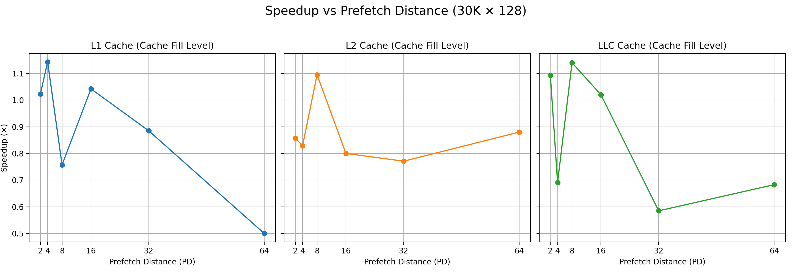
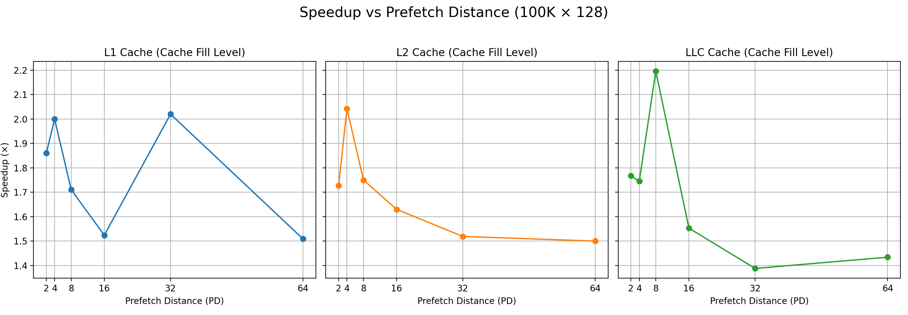
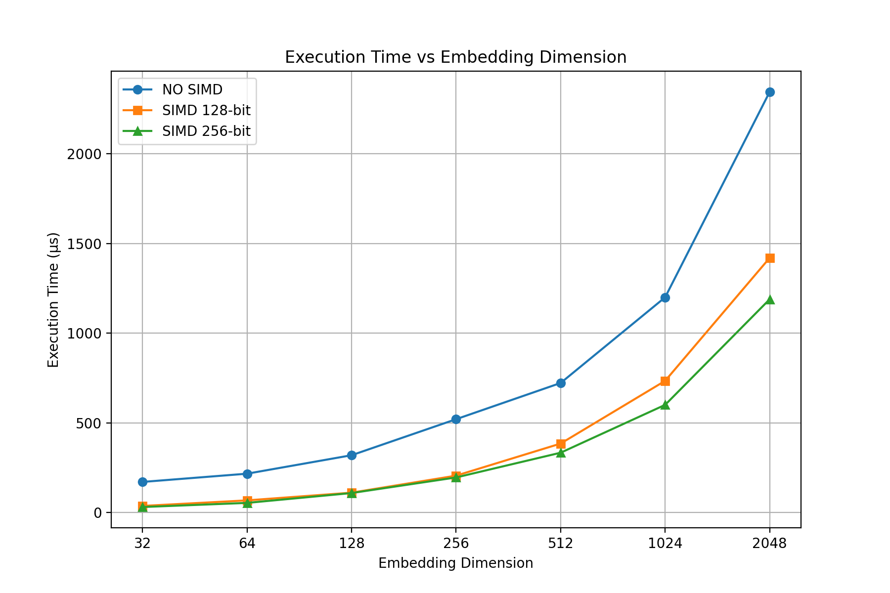
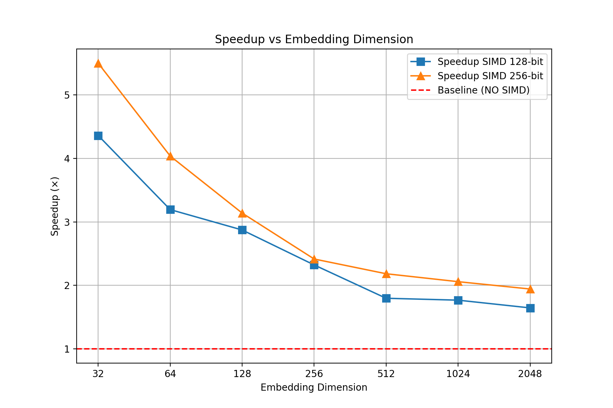

# Task 2A

## Legend
- **PD:** Page Dispatch (2,4,8,16,32,64)  
- **L1, L2, LLC:** Cache level misses  
- **SW Prefetch Request:** Number of software prefetch requests  
- **Execution Time:** µs  
- **Speedup:** Relative speedup  

---

### 30K × 128

| Metric                 | PD2 L1 | PD2 L2 | PD2 LLC | PD4 L1 | PD4 L2 | PD4 LLC | PD8 L1 | PD8 L2 | PD8 LLC | PD16 L1 | PD16 L2 | PD16 LLC | PD32 L1 | PD32 L2 | PD32 LLC | PD64 L1 | PD64 L2 | PD64 LLC |
|------------------------|--------|--------|--------|--------|--------|--------|--------|--------|--------|--------|--------|--------|--------|--------|--------|--------|--------|--------|
| **L1D Miss**           | 87K    | 88K    | 88K    | 89K    | 88K    | 88K    | 91K    | 93K    | 89K    | 90K    | 87K    | 89K    | 87K    | 89K    | 75K    | 90K    | 90K    | 81K    |
| **L2 Miss**            | 161K   | 131K   | 129K   | 132K   | 130K   | 132K   | 132K   | 145K   | 135K   | 133K   | 132K   | 135K   | 150K   | 140K   | 128K   | 168K   | 139K   | 166K   |
| **LLC Miss**           | 18K    | 19K    | 19K    | 20K    | 16K    | 16K    | 20K    | 21K    | 18K    | 19K    | 16K    | 17K    | 20K    | 21K    | 20K    | 20K    | 23K    | 22K    |
| **SW Prefetch Req.**   | 134    | 133    | 133    | 132    | 135    | 133    | 133    | 130    | 134    | 132    | 145    | 135    | 137    | 130    | 139    | 135    | 135    | 140    |
| **Execution Time (µs)**| 44     | 56     | 43     | 42     | 41     | 55     | 74     | 42     | 43     | 48     | 45     | 49     | 52     | 48     | 65     | 66     | 50     | 63     |
| **Speedup**            | 1.023x | 0.857x | 1.093x | 1.143x | 0.829x | 0.691x | 0.757x | 1.095x | **1.140x** | 1.042x | 0.800x | 1.020x | 0.885x | 0.771x | 0.585x | 0.500x | 0.880x | 0.683x |

**Speedup vs Prefetch Distance (for diff Cache Fill Level)**

---

### 100K × 128

| Metric                 | PD2 L1 | PD2 L2 | PD2 LLC | PD4 L1 | PD4 L2 | PD4 LLC | PD8 L1 | PD8 L2 | PD8 LLC | PD16 L1 | PD16 L2 | PD16 LLC | PD32 L1 | PD32 L2 | PD32 LLC | PD64 L1 | PD64 L2 | PD64 LLC |
|------------------------|--------|--------|--------|--------|--------|--------|--------|--------|--------|--------|--------|--------|--------|--------|--------|--------|--------|--------|
| **L1D Miss**           | 121K   | 147K   | 130K   | 150K   | 148K   | 151K   | 112K   | 110K   | 134K   | 147K   | 134K   | 149K   | 151K   | 143K   | 151K   | 135K   | 109K   | 104K   |
| **L2 Miss**            | 256K   | 261K   | 256K   | 305K   | 263K   | 269K   | 258K   | 261K   | 258K   | 259K   | 259K   | 287K   | 269K   | 265K   | 267K   | 253K   | 256K   | 253K   |
| **LLC Miss**           | 20K    | 20K    | 17K    | 20K    | 19K    | 17K    | 22K    | 19K    | 20K    | 22K    | 17K    | 19K    | 20K    | 18K    | 19K    | 22K    | 17K    | 18K    |
| **SW Prefetch Req.**   | 2.214K | 2.263K | 2.257K | 391    | 2.140K | 2.142K | 1.899K | 1.939K | 1.926K | 1.474K | 1.490K | 1.482K | 614    | 607    | 618    | 376    | 380    | 390    |
| **Execution Time (µs)**| 43     | 44     | 43     | 44     | 47     | 47     | 45     | 44     | 46     | 63     | 46     | 47     | 51     | 52     | 67     | 53     | 52     | 53     |
| **Speedup**            | 1.860x | 1.727x | 1.767x | 2.000x | 2.043x | 1.745x | 1.711x | 1.750x | **2.196x** | 1.524x | 1.630x | 1.553x | 2.020x | 1.519x | 1.388x | 1.509x | 1.500x | 1.434x |

**Speedup vs Prefetch Distance (for diff Cache Fill Level)**

---

### 1M × 128 (Corrected Values)

| Metric                 | PD2 L1 | PD2 L2 | PD2 LLC | PD4 L1 | PD4 L2 | PD4 LLC | PD8 L1 | PD8 L2 | PD8 LLC | PD16 L1 | PD16 L2 | PD16 LLC | PD32 L1 | PD32 L2 | PD32 LLC | PD64 L1 | PD64 L2 | PD64 LLC |
|------------------------|--------|--------|--------|--------|--------|--------|--------|--------|--------|--------|--------|--------|--------|--------|--------|--------|--------|--------|
| **L1D Miss**           | 806K   | 758K   | 807K   | 806K   | 767K   | 810K   | 783K   | 783K   | 766K   | 827K   | 791K   | 786K   | 814K   | 792K   | 778K   | 869K   | 808K   | 774K   |
| **L2 Miss**            | 1,970K | 1,977K | 1,966K | 2,018K | 1,976K | 2,038K | 2,013K | 1,965K | 1,996K | 2,016K | 1,985K | 2,009K | 2,058K | 2,018K | 2,083K | 2,080K | 2,009K | 2,005K |
| **LLC Miss**           | 99K    | 103K   | 101K   | 156K   | 107K   | 123K   | 119K   | 103K   | 114K   | 114K   | 107K   | 113K   | 138K   | 109K   | 119K   | 163K   | 143K   | 113K   |
| **SW Prefetch Req.**   | 5.684K | 3.786K | 3.788K | 3.795K | 3.794K | 3.781K | 3.795K | 5.309K | 3.789K | 3.798K | 3.787K | 3.790K | 3.796K | 3.787K | 3.801K | 3.797K | 3.774K | 3.791K |
| **Execution Time (µs)**| 54     | 55     | 55     | 71     | 49     | 49     | 56     | 49     | 46     | 70     | 59     | 61     | 87     | 63     | 75     | 64     | 77     | 72     |
| **Speedup**            | 2.407x | 2.255x | 2.236x | 1.944x | 2.510x | 2.592x | 2.214x | **2.878x** | 2.717x | 1.814x | 2.034x | 2.082x | 1.414x | 1.905x | 1.653x | 1.969x | 1.675x | 1.708x |

**Speedup vs Prefetch Distance (for diff Cache Fill Level)**

---

### Summary
- In **majority of cases**, a **PD of 8** provided the best performance.  
- **LLC cache fill level** consistently showed higher speedup across different datasets and prefetch distances.

# Task 2B

## Embedding Size = 1,000,000
|                    | Embedding Dimension → | 32     | 64     | 128    | 256    | 512    | 1024   | 2048   |
|--------------------|------------------------|--------|--------|--------|--------|--------|--------|--------|
| **NO SIMD**        | Instructions           | 10.6B  | 21.2B  | 42.3B  | 84.7B  | 169.6B | 339.1B | 678.2B |
|                    | Execution Time (µs)         | 170    | 216    | 319    | 520    | 722    | 1200   | 2346   |
| **SIMD 128 bits**  | Instructions           | 10.6B  | 21.1B  | 42.1B  | 84.1B  | 168.1B | 336.2B | 672.5B |
|                    | Execution Time (µs)         | 36     | 67     | 110    | 205    | 384    | 734    | 1420   |
| **SIMD 256 bits**  | Instructions           | 10.5B  | 21.0B  | 42.0B  | 84.0B  | 168.1B | 336.3B | 672.5B |
|                    | Execution Time (µs)         | 30     | 53     | 108    | 195    | 333    | 600    | 1189   |
| **Speedup**        | SIMD 128               | 4.36x  | 3.19x  | 2.87x  | 2.32x  | 1.80x  | 1.77x  | 1.65x  |
|                    | SIMD 256               | 5.50x  | 4.04x  | 3.14x  | 2.42x  | 2.18x  | 2.06x  | 1.94x  |

---

### Plots

**SIMD Execution Time vs Embedding Dimension**

**Speedup vs Embedding Dimension**

---

### Notes
- **NO FLUSH before running SIMD used**  
- **CPU frequency pinned in *performance mode***  
- **K = Thousand, M = Million, B = Billion**  
- **Execution Time** is in **microseconds (µs)**  
- **SIMD width**: 128 bits and 256 bits used  

# Task 2C

## SPEEDUP Measurements

| SIZE      | DIM  | SW PREFETCH  (PD = 8 , CFL = L1)| SIMD    (256 bits)   | BOTH    (PD = 8 , CFL = L1,  SIMD = 256 bits)   | 
|-----------|------|-------------|-----------|-----------|
| 100K  | 64   | 1.218x     | 1.41x   | 1.705x   | 
| 1M | 8    | 1.6x         | 1.794x   | 2.483x   |
| 2M | 256  | 1.2x         | 1.516x   | 1.983x   |
| 40K    | 2048 | 1.104x    | 2.176x   | 2.354x   | 
| 100K   | 31   | 2.455x     | 1.554x   | 2.580x   |

<!-- | SIZE      | DIM  | SW Prefetch (PD = 8, CFL = L1) | SIMD (256 bits) | BOTH (PD = 8, CFL = L1, SIMD = 256 bits) | REMARKS                                           |
|-----------|------|--------------------------------|----------------|------------------------------------------|--------------------------------------------------|
| 100K      | 64   | 1.218x                         | 1.41x          | 1.705x                                   | Fits mostly in L1/L2, SIMD 256-bit effective   |
| 1M        | 8    | 1.6x                           | 1.794x         | 2.483x                                   | L3 cache bound, SIMD benefits                   |
| 2M        | 256  | 1.2x                           | 1.516x         | 1.983x                                   | Larger dataset, partial L3 reuse, SIMD 256-bit |
| 40K       | 2048 | 1.104x                         | 2.176x         | 2.354x                                   | Small dataset, L1/L2 cache fit, SIMD 256-bit   |
| 100K      | 31   | 2.455x                         | 1.554x         | 2.580x                                   | Untiled, smaller dimension                       | -->

---
### Comparative Performance Plot

**SW Prefetch vs SIMD vs BOTH vs Baseline**

*Description:* For each size × dimension, this plot compares:  
1. **SW Prefetch only (PD = 8, CFL = L1)**  
2. **SIMD only (256 bits)**  
3. **Both combined (PD = 8, CFL = L1, SIMD = 256 bits)**  
4. **Baseline (No SW Prefetch, No SIMD)**  
---
## Notes

- **CPU & System:** Intel 12th Gen Core i5-12400, 6 cores / 12 threads, max 4.4 GHz.  
- **Cache Hierarchy:**  
  - L1 Data: 48 KB/core  
  - L1 Instruction: 32 KB/core  
  - L2: 1.25 MB/core  
  - L3: 18 MB shared  
- **Memory & SIMD Settings:**  
  - Embedding calculation on **float (4 bytes)**  
  - **SIMD 256-bit** used  
  - **Load/Store:** `loadu` / `storeu` instructions  
  - **HW prefetch:** Disabled  
  - **Flush:** Enabled (cold misses observed)  
- **Performance Mode:** CPU frequency fixed  
- **Page-Dispatch (PD):** 8  
- **Cache Fill Level:** 1  
- Notes capture **experimental setup** affecting speedup measurements.
