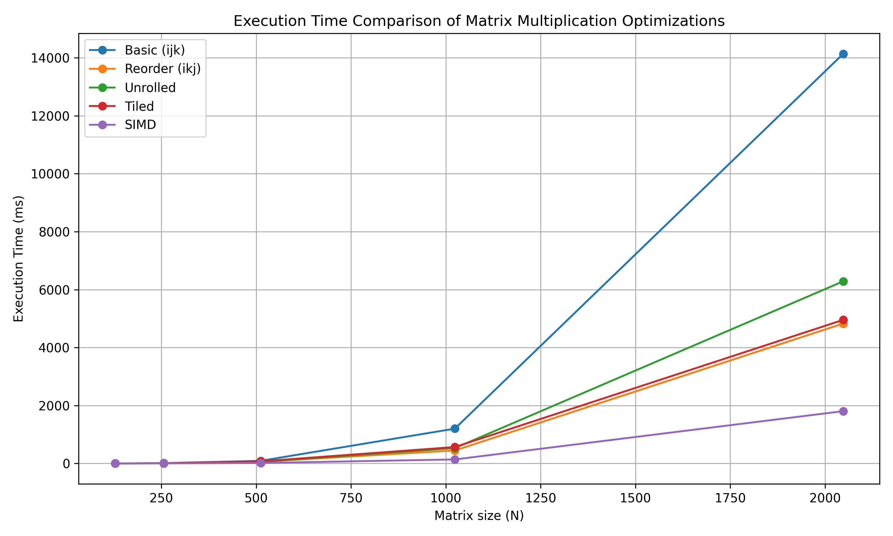
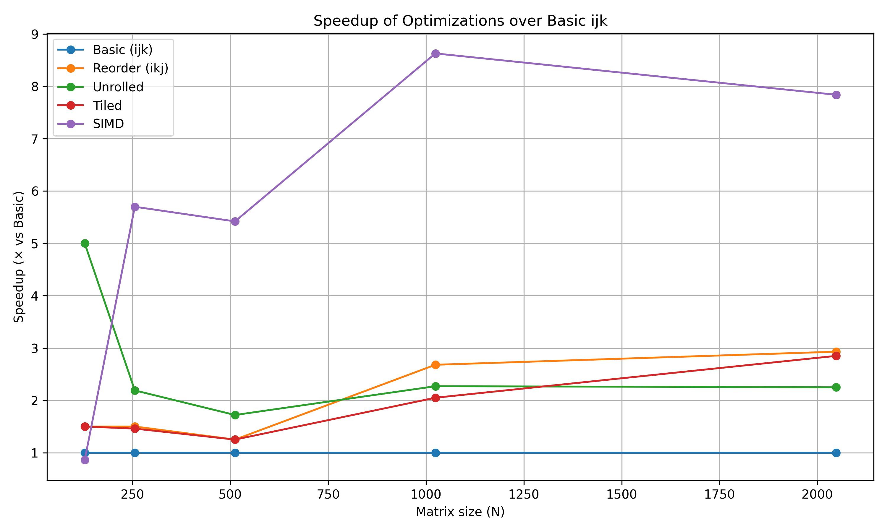

## **Task 1E: Confusion hi confusion hai !!**

---

### **1. Execution time (ms):**

| Matrix size (N) | Basic (ijk) | Reorder (ikj) | Unrolled | Tiled | SIMD |
| :-------------- | :---------- | :------------ | :------- | :---- | :--- |
| **128**  | **1.2**    | **0.8**    | **0.0–0.2** | **0.8**  | **~1.41.00** |
| **256**  | **11.4**   | **7.6**    | **5.2**     | **7.8**  | **2.0** |
| **512**  | **91**     | **58**     | **53**      | **73**   | **16.8** |
| **1024** | **1202**   | **448**    | **530**     | **567**  | **139** |
| **2048** | **14138**  | **4828**   | **6286**    | **4955** | **1805** |

---

### **2. SpeedUp:**

| Matrix size (N) | Basic (ijk) | Reorder (ikj) | Unrolled | Tiled | SIMD |
| :-------------- | :---------- | :------------ | :------- | :---- | :--- |
| **128**  | **1.00** | **1.50** | **>>1 (unstable)** | **1.50** | **0.86× (slower)** |
| **256**  | **1.00** | **1.50** | **2.19** | **1.46** | **5.70×** |
| **512**  | **1.00** | **1.25** | **1.72** | **1.25** | **5.42×** |
| **1024** | **1.00** | **2.68** | **2.27** | **2.05** | **8.63×** |
| **2048** | **1.00** | **2.93** | **2.25** | **2.85** | **7.83×** |

---

### **3. Plots: Execution Time & SpeedUp Comparison**

  
  

---

### **4. Reasoning:**

1. **Loop Reordering (ikj)** improves cache locality.  
   - For small matrices (N=128, 256), gives ~1.5×.  
   - For large matrices (N=1024, 2048), gives **2.7–2.9×** speedup due to efficient cache reuse.  

2. **Loop Unrolling** reduces loop overhead by performing multiple computations per iteration.  
   - At N=128, unstable (too small workload).  
   - For N ≥ 256, consistently better, reaching **~2.2×** speedup.  

3. **Tiling** tries to exploit spatial/temporal locality.  
   - Overhead of block management reduces benefits at small/medium sizes (1.2–1.5×).  
   - At large sizes (N=2048), achieves **~2.85×**.  

4. **SIMD** achieves the highest performance.  
   - At N=256, already gives **5.7×**.  
   - At N=1024, reaches **8.63×**.  
   - Vectorized instructions allow multiple multiplications per cycle.  
   - At N=128, setup overhead makes it slightly **slower than basic**.  
